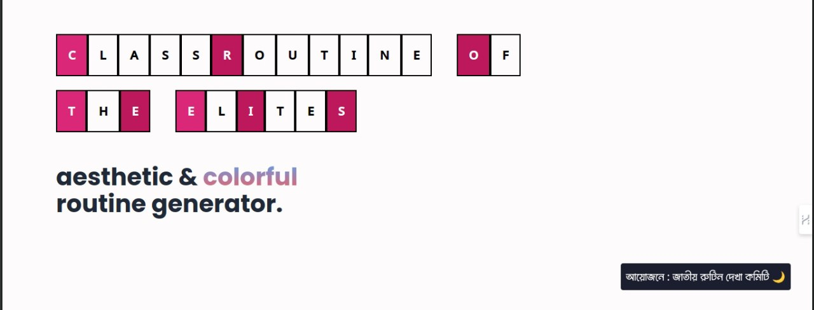

# Class Routine Of The Elites (CROTE)

An aesthetic & colorful class routine generator.

There was a time when people used to use Excel, Word, PowerPoint, Notion, X, Y, Z to create class routine. But that 'was' a time and now CROTE will take the responsibility.

Because, 'Class Routine Of The Elites' abstracts away all the complexities , and combines all the necessary features for making a visually pleasing colorful routine for your university classes.

## Features

- Each cell can be edited individually.
- 2 themes made available.
- Changes are saved in mongoDB database.
- Download the routine as png.

## Tech Stack

**Client:** Next.js ( App Router ), shadcn

**Server:** mongoDB, Express.js, puppeteer
